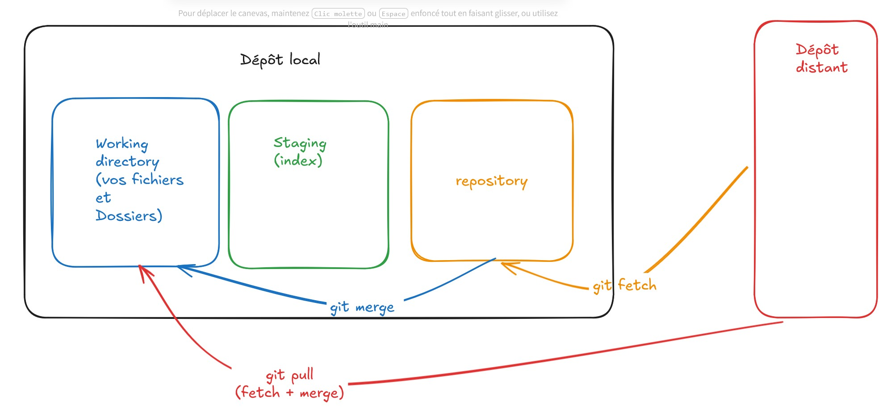
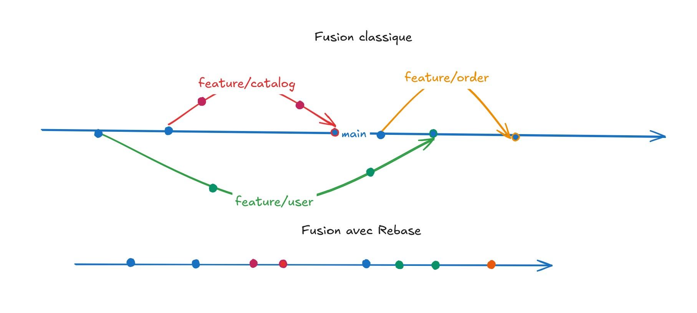

# Git

- [Cours à télécharger](https://drive.google.com/file/d/10KO4fs4wLYJ_iSaYP4QndgmRUyHWe6nV/view?usp=sharing)

## GoogleForms 

[Lien GoogleForms suiv 1/2 journée](https://docs.google.com/forms/d/e/1FAIpQLSfOw9YQLtn9yAp9DEet-4FJCSR0pMuD3KeOFwiV4aK6NJ-Uiw/viewform?usp=publish-editor)

---

## Corrections des ateliers 

[corrections de tous les ateliers](./ateliers/corrections/)

---

## Installations

### GIT

Lors de l'installation, gardez les paramètres par défaut.
[Téléchargez Git](https://git-scm.com/downloads)

### Installez l'éditeur de code Visual Studio Code

[Téléchargez Visual Studio Code](https://code.visualstudio.com/Download)

### Créez un compte GitHub

[Créez un compte GitHub](https://github.com/signup)

---

## Documentation

### Pour aller plus loin

- [En annexe ici, les commandes UNIX, conventions de nommage des branches et redaction du message de commit, etc.](./annexe.md)

### Configuration

1. Configuration minimale : nom, prénom et adresse e-mail.
A faire une seule fois, puis à nouveau lors de la mise à jour des informations précédentes
- `git config --global user.name "Glodie Tshimini"`
- `git config --global user.email "contact@tshimini.fr"`

---

### Initialisation d'un dépôt git et lien avec un dépôt distant

Ci-après, remplacer [URL] par l'URL de votre dépôt distant.

2. Initialiser un dépôt git : (à faire une seule fois, pas nécessaire lorsqu'on a cloné un dépôt distant en local)
- `git init`

3. Relier un dépôt local avec un dépôt distant : (à faire une seule fois, refaire lorsque vous avez changé de dépôt ou d'hébergeur git)
- `git remote add origin [URL]`
`origin` est l'alias qu'on donne à notre URL, cette alias sert à faire référence à URL (plus facile de retenir origin que votre URL pour vos manipulations futures).
Par convention l'alias se nomme `origin` mais si on le souhaite on peut le nommer comme on l'entend.

4. Cloner un dépôt distant en local
- `git clone [URL]`

---

### Les branches

5. Renommer une branche
- `git branch -m oldname newname`
Exemple pour le renommage de la branche master en main :
- `git branch -m master main`
- `git branch -M main` : renommer la branche courante (pas besoin de spécifier l'ancien nom)

6. Créer une branche (on ne peut pas créer une nouvelle branche tant qu'il n'y a pas au moins un commit dans notre dépôt) :
- `git branch newBranch`

7. Se déplacer dans une branche pour y travailler :
- `git checkout newBranch`

8. Créer et se déplacer dans la nouvelle branche pour y travailler sur une nouvelle version du projet :
- `git checkout -b anotherNewBranch`

#### Fusionnez les branches

9.	Fusionner 2 branches A et B (ci-après B est la branche source et A la branche de réception, toujours se positionner d'abord dans la branche de réception avant de faire la fusion) :
- `git checkout A`
- `git merge B`
Le travail effectué dans la branche B sera rajouté dans la branche A.

##### Gestion des conflits

Durant les fusions, les conflits peuvent avoir lieu.

Un conflit a lieu :
- Lors de la fusion de 2 branches ;
- Lorsque vous avez effectué des modifications sur le même fichier au même endroit dans les 2 branches.

Pour résoudre le conflit :
- Choisir une version du fichier (version de la branche A, version de la branche B, une résultante des 2 branches etc.) ;
- Effectuer un commit.

#### Illustration des branches

---

### État du dépôt

10.	Voir l’état du dépôt (fichiers/dossiers nouveaux, modifiés, supprimés et présents dans l'index) :
- `git status`

---

### Ajouter les fichiers/dossiers dans l'index

11. Ajouter un fichier dans l’index (salle d'attente des modifications des fichiers qui seront envoyés vers le dépôt distant après l'exécution des commandes commit et push) : 
- `git add fichier.txt`

---

### Commiter vos modifications

Sert à dire à git qu'on vient de passer à une nouvelle version de son projet. Les modifications pourront ensuite être synchronisé avec le dépôt distant

12. Premier commit :
- `git commit -m "first commit"`

13. Ajouter un commit :
- `git commit -m "here message = reason(s) for your modifications"`

#### Historiques des commits

14. Voir l’historique des commits :
- `git log`

---

### Envoyer les modifications du dépôt local vers le dépôt distant (pousser)

15.	Envoyer les modifications en ligne (local vers GitHub) :
- `git push origin main`
`origin` est l'alias de l'URL de notre dépôt distant.

---

### Récupérer les modifications effectuées depuis le dépôt distant dans votre dépôt local (tirer)

16.	Récupérer les modifications sans fusionner (par exemple récupérer les branches crées sur GitHub) :
- `git fetch`

17.	Récupérer les modifications depuis le dépôt distant (GitHub vers local) :
- `git pull origin main`
- `pull` = `fetch` + `merge`

---

### Différences entre 2 commits

18. Différence entre 2 commits :
- `git diff [HASH1] [HASH2]`

19. Différence avec plus de précision sur l'auteur des modifications, l'heure etc.
- `git blame [HASH1] monfichier.txt`

---

### Ordre logique des commandes pour travailler avec git

`git add > git commit > git push`

- `git add` permet de passer du working directory au stage
- `git commit` permet de passer du stage au repository
- `git push` permet d'envoyer toutes les modifications qui ont été commitées (nouvelle version de son code) vers le repository distant GitHub

### Imbriquation dépôts git

Un dépôt enfant en tant que sous-dossier d'un dépôt parent.
- [subtree](https://www.atlassian.com/git/tutorials/git-subtree)
- [submodule](https://git-scm.com/book/en/v2/Git-Tools-Submodules)

## Rebase

Pour avoir un historique linéaire, les commits des autres branches sont rejoués dans la branche de base (main).

